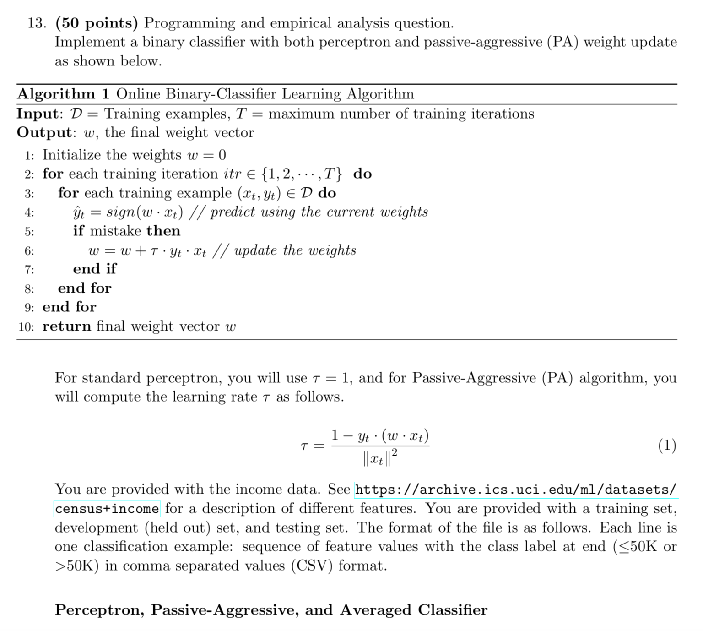
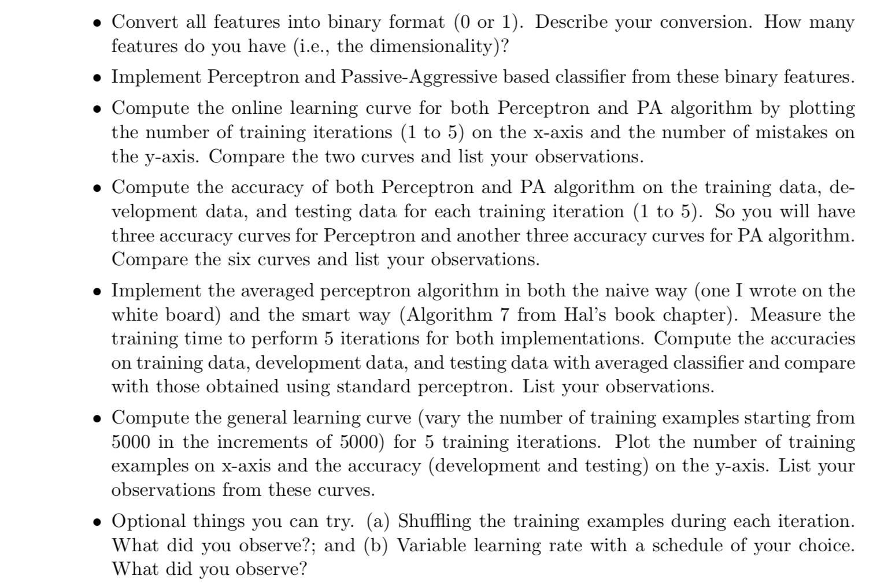
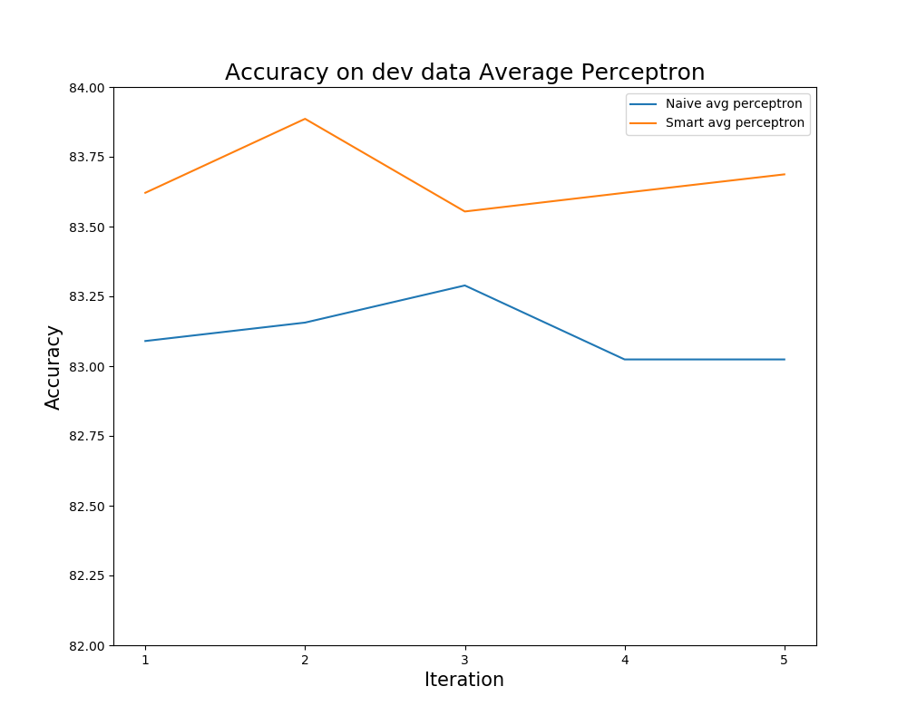
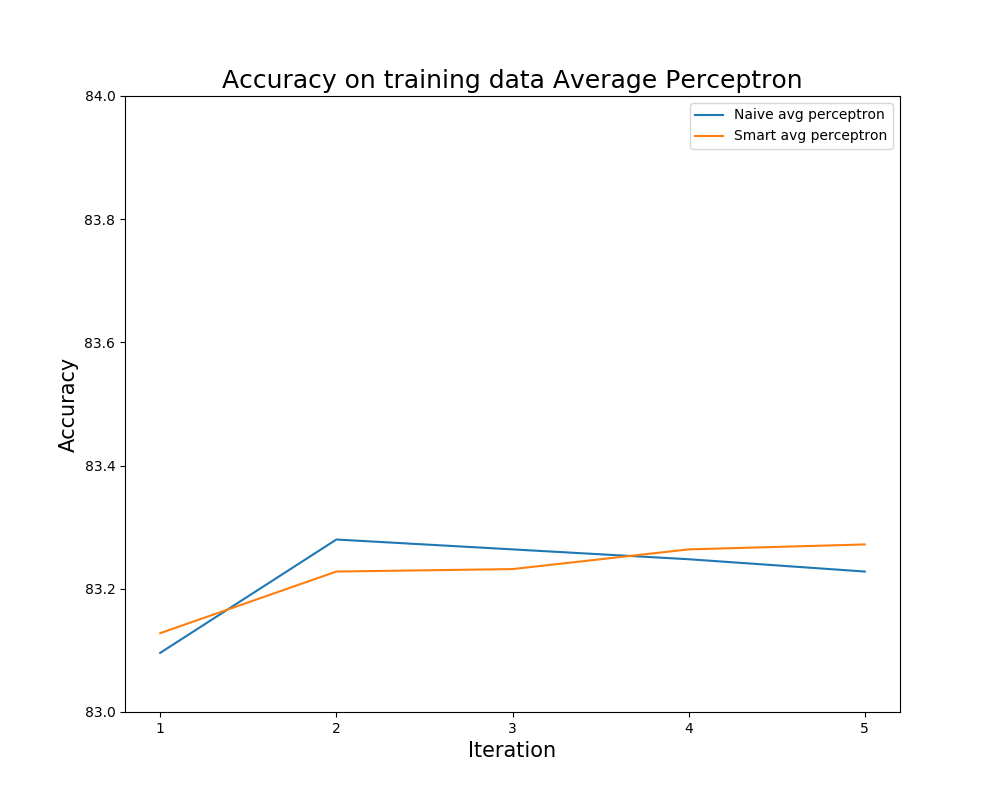
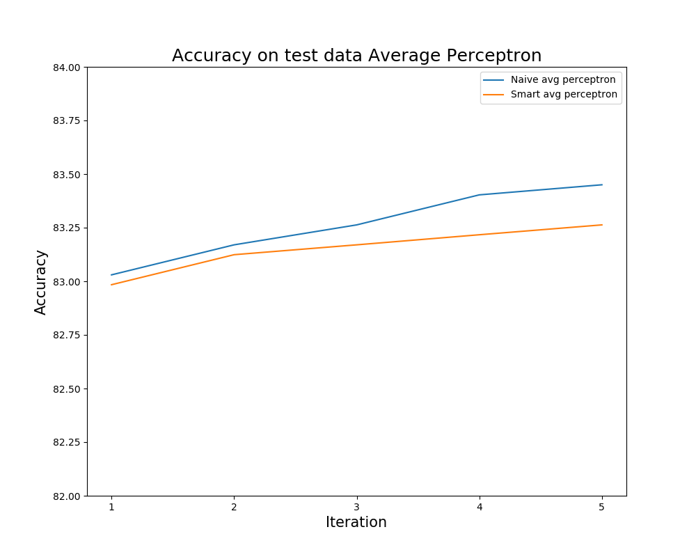

# Perceptron_avg_vs_passiveAggresive

=============== Perceptron ===============

Preparing data.....

=============== Standard Perceptron and Passive Aggressive Perceptron ===============

Training and Testing on Standard Perceptron and Passive Aggressive Perceptron.....

Plotting for Standard and PA perceptron

Varying data in increments of 5000 and training

=============== Average Perceptron ===============
  
  
Training and Testing on Naive Average Perceptron vs Smart Average Perceptron.....  
  
--- Naive avg perceptron took: 0.3811531066894531 seconds ---  
--- Smart avg perceptron took: 0.3231511116027832 seconds ---  
Ans 13 Done.....

==============================

  

 

 

 

 

 

 
